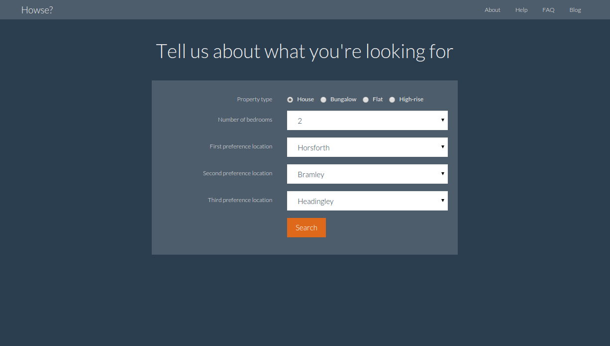
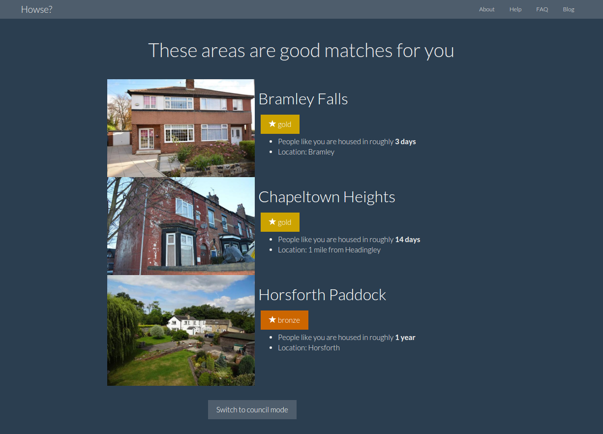
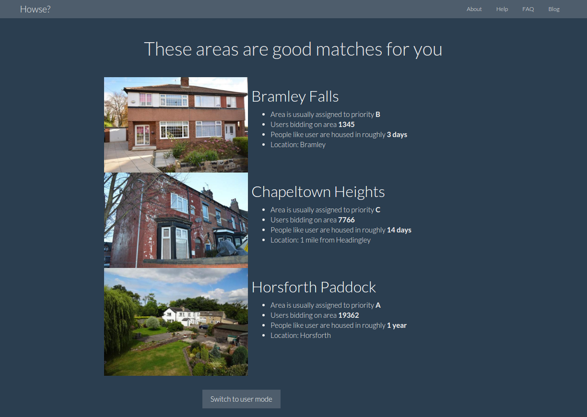
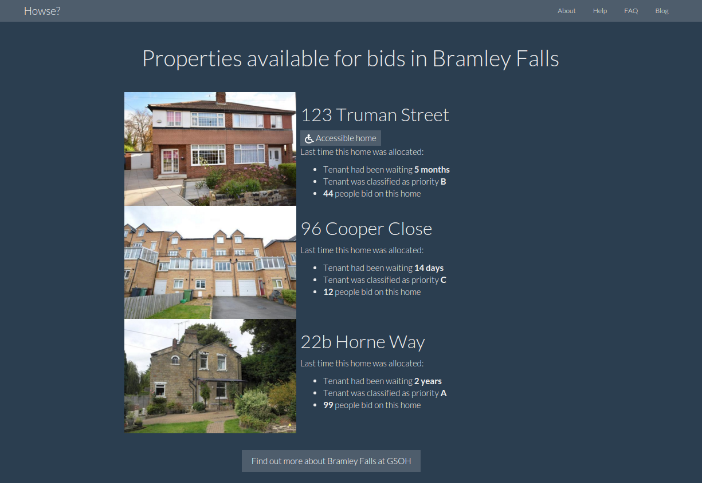
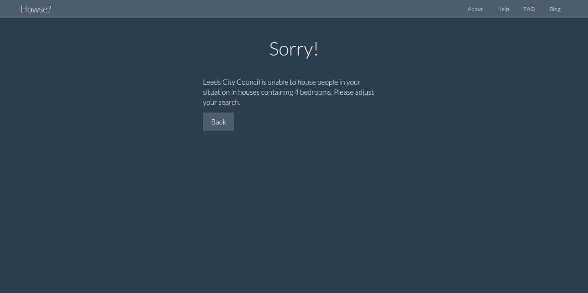

# Howse? - Non-functional prototype

**Howse?** is a design for a web app that came out of the Leeds City Council social housing innovation lab on 23 Feb 2016.

This concept turns the existing home-centric view of choice-based lettings upside-down, taking a more user-centric view.

The purpose of this is to use the intersection of the user's own personal circumstances with statistical data about a given area/home so the user has a better idea of their chances of being rehoused in that area.

## The demo

You can visit the demo site at <https://howse.herokuapp.com/>. (This is a free Heroku app, so it may need a few seconds to "wake up" when you first visit it.)

**Note**: The demo is *non-functional*, which means that it contains no real data and only presents the same results regardless of what is entered.

### Profile / sign-in screen

The first screen asks the user for demographic information, including the housing priority they have been assigned by LCC. A real functional system would probably require the user to sign in and then this data could be pulled from an external source such as Orchard.

### Search screen

After the user has signed in, they can search for the kind of property they want, similar to the existing Leeds Homes site. Here they can specify the number of bedrooms they want and their three favourite regions of Leeds.

### Area results

*Howse?* would then take the information about the user and the search and find areas that the user is likely to be rehoused in.

The definition of an *area* is loose, but I imagine it to be something smaller than a ward and larger than a street (for example, an estate).

The results are:

1. Given a rating 'gold', 'silver' or 'bronze' based on the likelihood of that particular user being housed in that area.
2. Only areas in or *near* the user's chosen areas. In this example, the user chose Headingley as a preferred area so it has recommended Chapeltown as being nearby.
3. Ordered by likelihood of being rehoused in that area.
4. Only areas that have at least one property the user is permitted to be rehoused in. For example, if all properties in a given area require the user to be over 50, the area will not be shown to users under 50.
5. All areas with permitted houses will be listed, even if they're unlikely ('bronze').

If the tool was being used by a council employee (e.g. guiding a user over the phone or in a one-stop shop), there could be a different view containing more detailed statistics that break down the 'gold/silver/bronze' into more detail that a user may find overwhelming (see below).

### Home results

Clicking on an area takes you to the more traditional Leeds Homes view of the homes that can be bid on in that area. This will include all the stats from the old brochure, including the information about the last time someone was rehoused in that home.

This page could also be linked through to [GSOH](https://fishpercolator.co.uk/presentations/gsohome/) for more information about a given area, once that site is operational.

### 'Sorry!' page

If the user picks search criteria that are incompatible with their needs (e.g. in this example if they ask for 4+ bedrooms), the site can stop immediately and take them to a 'Sorry' page explaining why their search doesn't fit their needs. This page could provide them with a route to update their demographic information if it is currently inaccurate.

## Implementation challenges

The hardest part of this challenge would be the matching algorithm that determines whether a given area is 'gold/silver/bronze'. This algorithm needs to analyse historical data for a given demographic in that area and allocate the category based on the wait time / number of bids for all houses in that area over the last few years.

Another challenge will be getting all of the data from Leeds Homes into the site, which will require some sort of API or periodic dump from the existing database.

## Future

There are lots of areas where this tool could be improved following a pilot. The most interesting involve linking the user to their actual case in Orchard and using this to present them with more information about their previous (and current) bids and why they may have been unsuccessful.

## Any questions

Please contact me at <rich@fishpercolator.co.uk> with any questions!
