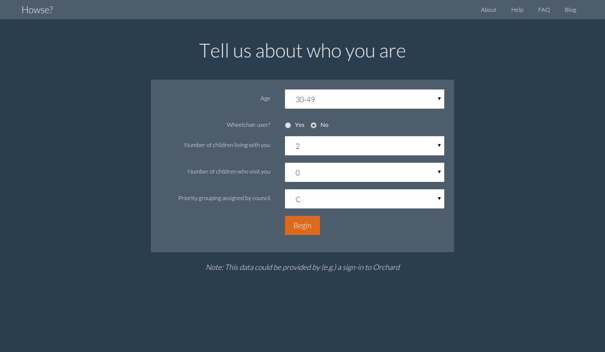

# Howse? - Non-functional prototype

**Howse?** is a design for a web app that came out of the Leeds City Council social housing innovation lab on 23 Feb 2016.

This concept turns the existing home-centric view of choice-based lettings upside-down, taking a more user-centric view.

## The demo

You can visit the demo site at <https://howse.herokuapp.com/>. (This is a free Heroku app, so it may need a few seconds to "wake up" when you first visit it.)

**Note**: The demo is *non-functional*, which means that it contains no real data and only presents the same results regardless of what is entered.

### Profile / sign-in screen

The first screen asks the user for demographic information, including the housing priority they have been assigned by LCC. A real functional system would probably require the user to sign in and then this data could be pulled from an external source such as Orchard.

## Implementation challenges

## Future

